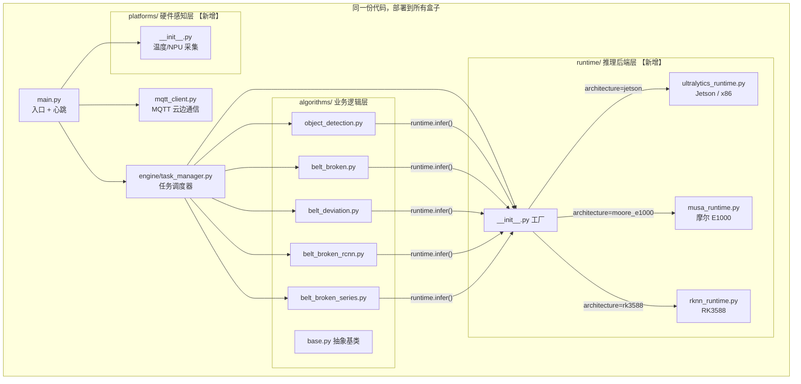

# Edge-Agent 多平台重构 — 实施完成报告

## 架构总览



## 修改清单

### 新增文件 (6个)
| 文件 | 用途 |
|------|------|
| `runtime/__init__.py` | 推理后端工厂 `create_runtime(arch)` |
| `runtime/base_runtime.py` | 统一接口 `BaseRuntime` + `DetectionResult` + `DetectionBox` |
| `runtime/ultralytics_runtime.py` | Jetson/x86: `ultralytics YOLO` |
| `runtime/musa_runtime.py` | 摩尔 E1000: `torch_musa + ultralytics` |
| `runtime/rknn_runtime.py` | RK3588: `rknnlite` + YOLOv8后处理 |
| `platforms/__init__.py` | 多平台温度/NPU信息采集 |

### 新增依赖文件 (2个)
| 文件 | 平台 |
|------|------|
| `requirements-moore.txt` | 摩尔 E1000 (torch_musa) |
| `requirements-rk3588.txt` | RK3588 (rknn-toolkit2) |

### 修改文件 (9个)
| 文件 | 改动要点 |
|------|----------|
| `main.py` | 引入 `platforms` 模块，心跳上报平台特定硬件信息 |
| `engine/task_manager.py` | 启动时 `create_runtime(config['architecture'])`，注入到算法 |
| `algorithms/base.py` | `process()` 签名新增 `runtime` 参数；移除 `torch` 依赖 |
| `algorithms/__init__.py` | 移除 `template_algorithm` 注册 |
| `algorithms/object_detection.py` | `YOLO()` → `runtime.load()` + `runtime.infer()` |
| `algorithms/belt_broken.py` | 同上 |
| `algorithms/belt_deviation_detection.py` | 同上 + 掩码访问适配 `result.masks` |
| `algorithms/belt_broken_rcnn.py` | 同上 |
| `algorithms/belt_broken_series.py` | 同上 |

### 清理文件
| 文件 | 原因 |
|------|------|
| `algorithms/template_algorithm.py` | 已删除。错误 import Flask db，不属于边缘端 |
| `utils/calc.py` | 移除了无用的 `import torch` |
| `requirements.txt` | 精简为纯通用依赖，移除 ultralytics/torch |
| `requirements-cpu.txt` | 简化 |

## 部署指南

每台盒子只需改 **1 行配置** + 安装 **1 个对应的 requirements**：

```bash
# ===== Jetson Orin/Nano =====
# config.yaml:
architecture: "jetson"
# 安装:
pip install -r requirements-jetson.txt

# ===== 摩尔 E1000 =====
# config.yaml:
architecture: "moore_e1000"
# 安装:
pip install -r requirements-moore.txt
# 额外: 从摩尔官方安装 torch_musa

# ===== RK3588 =====
# config.yaml:
architecture: "rk3588"
# 安装:
pip install -r requirements-rk3588.txt
# 额外: 从瑞芯微官方安装 rknn-toolkit2

# ===== 开发调试 (PC) =====
# config.yaml:
architecture: "x86"
# 安装:
pip install -r requirements-cpu.txt
```

## 统一推理接口

所有算法现在通过统一的 `runtime` 对象调用推理：

```python
# 算法代码中（任何一个 .py）:
runtime.load(model_path)                          # 加载模型
result = runtime.infer(frame, conf=0.5, classes=[0])  # 推理

# 统一的结果访问方式:
result.count          # 检测到的目标数量
result.boxes          # 检测框列表 [DetectionBox, ...]
result.masks          # 分割掩码 (可选)

for box in result.boxes:
    box.x1, box.y1, box.x2, box.y2  # 坐标
    box.confidence                    # 置信度
    box.class_id                      # 类别
    box.foot_center                   # 脚部中心点 (用于 ROI)
```

> [!TIP]
> 要添加新平台，只需 3 步：
> 1. 在 `runtime/` 下新建 `xxx_runtime.py`，实现 `BaseRuntime` 接口
> 2. 在 `runtime/__init__.py` 的 `create_runtime()` 中添加映射
> 3. 新建 `requirements-xxx.txt`
