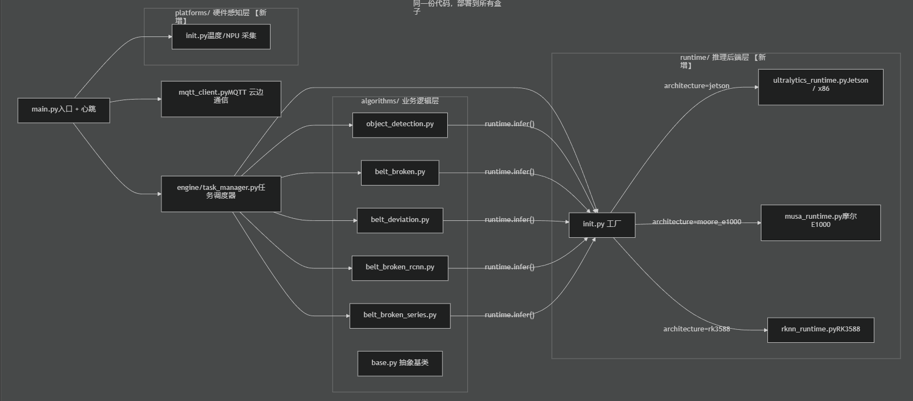

# Edge-Agent 多平台重构 — 实施完成报告

## 架构总览



## 修改清单

### 文件 (6个)
| 文件 | 用途 |
|------|------|
| `runtime/__init__.py` | 推理后端工厂 `create_runtime(arch)` |
| `runtime/base_runtime.py` | 统一接口 `BaseRuntime` + `DetectionResult` + `DetectionBox` |
| `runtime/ultralytics_runtime.py` | Jetson/x86: `ultralytics YOLO` |
| `runtime/musa_runtime.py` | 摩尔 E1000: `torch_musa + ultralytics` |
| `runtime/rknn_runtime.py` | RK3588: `rknnlite` + YOLOv8后处理 |
| `platforms/__init__.py` | 多平台温度/NPU信息采集 |

### 依赖文件 (2个)
| 文件 | 平台 |
|------|------|
| `requirements-moore.txt` | 摩尔 E1000 (torch_musa) |
| `requirements-rk3588.txt` | RK3588 (rknn-toolkit2) |

### 文件 (9个)
| 文件 | 要点 |
|------|----------|
| `main.py` | 引入 `platforms` 模块，心跳上报平台特定硬件信息 |
| `engine/task_manager.py` | 启动时 `create_runtime(config['architecture'])`，注入到算法 |
| `algorithms/base.py` | `process()` 签名新增 `runtime` 参数；移除 `torch` 依赖 |
| `algorithms/object_detection.py` | `YOLO()` → `runtime.load()` + `runtime.infer()` |
| `algorithms/belt_broken.py` | 同上 |
| `algorithms/belt_deviation_detection.py` | 同上 + 掩码访问适配 `result.masks` |
| `algorithms/belt_broken_rcnn.py` | 同上 |
| `algorithms/belt_broken_series.py` | 同上 |


## 部署指南

每台盒子只需改 **1 行配置** + 安装 **1 个对应的 requirements**：

```bash
# ===== Jetson Orin/Nano =====
# config.yaml:
architecture: "jetson"
# 安装:
pip install -r requirements-jetson.txt

# ===== 摩尔 E1000 =====
# config.yaml:
architecture: "moore_e1000"
# 安装:
pip install -r requirements-moore.txt
# 额外: 从摩尔官方安装 torch_musa

# ===== RK3588 =====
# config.yaml:
architecture: "rk3588"
# 安装:
pip install -r requirements-rk3588.txt
# 额外: 从瑞芯微官方安装 rknn-toolkit2

# ===== 开发调试 (PC) =====
# config.yaml:
architecture: "x86"
# 安装:
pip install -r requirements-cpu.txt
```

## 统一推理接口

所有算法现在通过统一的 `runtime` 对象调用推理：

```python
# 算法代码中（任何一个 .py）:
runtime.load(model_path)                          # 加载模型
result = runtime.infer(frame, conf=0.5, classes=[0])  # 推理

# 统一的结果访问方式:
result.count          # 检测到的目标数量
result.boxes          # 检测框列表 [DetectionBox, ...]
result.masks          # 分割掩码 (可选)

for box in result.boxes:
    box.x1, box.y1, box.x2, box.y2  # 坐标
    box.confidence                    # 置信度
    box.class_id                      # 类别
    box.foot_center                   # 脚部中心点 (用于 ROI)
```

> [!TIP]
> 要添加新平台，只需 3 步：
> 1. 在 `runtime/` 下新建 `xxx_runtime.py`，实现 `BaseRuntime` 接口
> 2. 在 `runtime/__init__.py` 的 `create_runtime()` 中添加映射
> 3. 新建 `requirements-xxx.txt`


## 编译安装libmtnn-api-4py

git clone https://gitee.com/MooreThreads-AI-SOC/m1000_mtnn.git


## 模型转换

python: Python 3.10.12

git clone //gitee.com/MooreThreads-AI-SOC/m1000_npu_model_zoo.git
cd Object_Detection/001yolov8m
python export.py

## Docker 部署与远程电源（推荐）

平台可通过 MQTT 下发：
- `agent/restart`：Agent 优雅停任务后退出进程，Docker Compose `restart: unless-stopped` 自动拉起容器。
- `agent/power`（`reboot` / `shutdown`）：停任务后通过 `nsenter` 重启或关闭**宿主机**。
  需 `privileged: true` 与 `pid: host`。关机后由平台「网络唤醒」发送 WoL 魔术包（网卡需开启 WOL，且与平台同一二层网络）。

### Jetson（默认）

基础镜像：`ultralytics/ultralytics:latest-jetson-jetpack6`（`--runtime=nvidia` + `--ipc=host`）。

```bash
# 1. 编辑 config.yaml：architecture: jetson，并填写平台 MQTT / API 地址
# 2. 构建并启动
docker compose up -d --build
```

步骤说明见 [JETSON_DEPLOY.md](JETSON_DEPLOY.md)。

### x86 / CPU 调试

```bash
# 先将 config.yaml 中 architecture 改为 x86
docker compose --profile x86 up -d --build
```

详见同目录 `Dockerfile`、`docker-compose.yml`。
